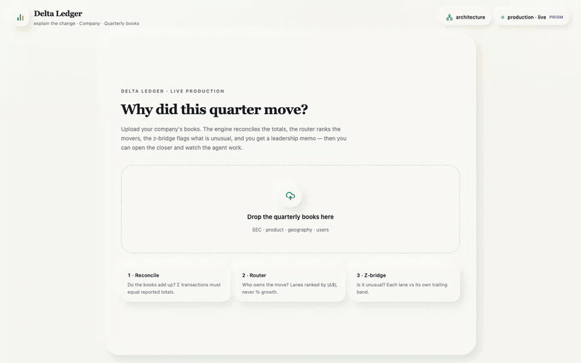
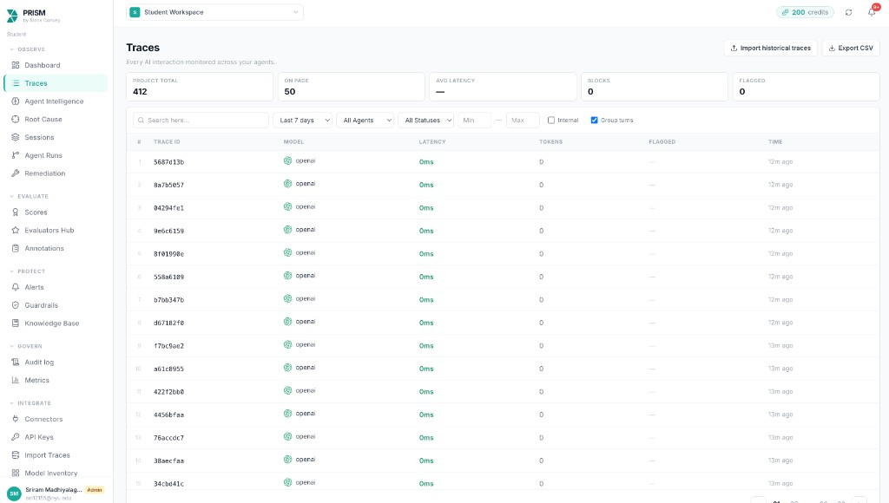
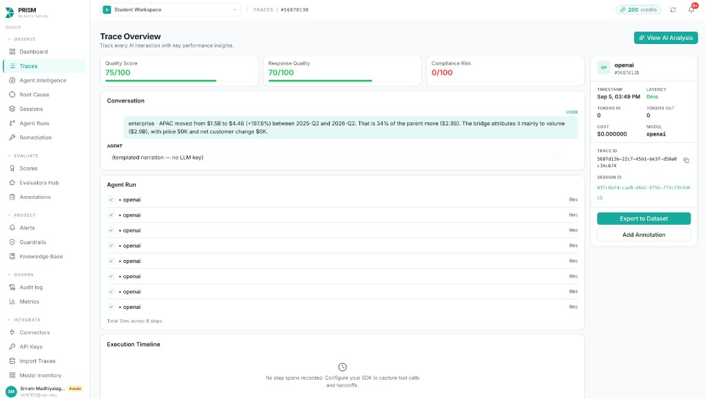

<h1 align="center">Delta Ledger</h1>

<p align="center"><b>Explain the Change — an auditable FP&amp;A agent that shows exactly why a financial metric moved.</b></p>

<p align="center">
  
  
  
  
  
</p>

<p align="center">
  <a href="#why-this-exists">Problem</a> ·
  <a href="#what-we-built">Solution</a> ·
  <a href="#system-architecture">Architecture</a> ·
  <a href="#how-the-analysis-works">Method</a> ·
  <a href="#prism--trace-evidence">PRISM</a> ·
  <a href="#quickstart">Quickstart</a>
</p>

<p align="center">
  
</p>

<p align="center"><i>One complete product walk: upload company books → reconcile → route the largest movements → inspect the live lineage → open the leadership evidence book. Regenerate it with <code>cd console &amp;&amp; npm run film</code>.</i></p>

Built for the **Maximor — Money Operations — Explain the Change** track.

## Why this exists

Every close produces the same leadership question:

> “Revenue moved 18%. Why?”

The answer is spread across reported totals, product segments, geography,
operating KPIs, and account-level books. Finance teams spend days reconciling
those sources before they can explain the movement.

Traditional dashboards show **what** changed, but not the evidence chain behind
**why** it changed. A general LLM is not a safe substitute: it can produce
plausible arithmetic that does not tie to the reported books.

Leadership needs a concise answer. Finance and audit teams need to reproduce
every number behind it.

## What we built

Delta Ledger separates arithmetic, narration, and presentation:

1. A **deterministic evidence engine** validates and reconciles the uploaded
   books, ranks movements by absolute dollars, calculates z-scores, constructs
   exact bridges, measures concentration, and drills to material detail.
2. An **evidence-scoped narrator** can only rephrase completed engine output.
   It never performs the calculation.
3. A **live lineage console** presents the same run at two levels:
   - **High level** for leadership.
   - **Detailed audit** for finance, operators, and reviewers.
4. A **leadership brief** turns the result into a board-ready summary, ranked
   driver cards, watch-outs, recalled company patterns, and an evidence book.
5. **PRISM** records narration traces and the completed agent trajectory.

The core boundary is simple:

> **The engine computes. The narrator explains. The lineage proves.**

## Key capabilities

### Upload to analysis

Upload the company CSV pack. Delta Ledger validates the schema, reconciles
control totals, runs the complete analysis, persists the evidence bundle, and
opens the executive summary automatically.

### Two levels of live lineage

- **Leadership lineage:** Reconcile → Context → Router → Top movers → Evidence
  → Explained.
- **Detailed lineage:** every z-bridge, dollar bridge, cluster, materiality
  decision, recursive drill, and tagged explanation.

Both views fold the same append-only event stream; the high-level view does not
hide or recompute a different answer.

### Materiality discipline

- Branches rank by `|Δ$|`, never percentage growth.
- The default materiality floor is 5% of the parent movement.
- Drilling stops when 80% of the movement is explained or depth reaches 4.
- Capped branches remain visible in the audit trail.

### Operational identities

Financial movement is connected to operating mechanics. For example, Search
revenue is checked against `paid clicks × CPC`. Residuals are shown rather than
silently absorbed.

### Company memory

Each completed run compiles normal ranges, recurring drivers, streaks,
seasonality, prior explanations, and concentration patterns. Later runs recall
plain memory rows without calling a model inside the attribution loop.

### Evidence-scoped follow-ups

Click any lineage node and ask a question. The answer is restricted to that
node’s computed evidence.

## System architecture

<p align="center">
  
</p>

The data path is:

```text
Company CSVs
  → FastAPI
  → normalize + reconcile
  → external context
  → route by |Δ$|
  → z-score + exact attribution
  → cluster + materiality drill
  → evidence JSON
  → tagged narration
  → company memory + PRISM
  → leadership brief + live lineage
```

See [docs/architecture.md](docs/architecture.md) for the component-level
walkthrough, or open **Architecture** inside the console.

## How the analysis works

### 1. Reconcile — do the books add up?

Uploaded files are normalized into one company dataset. Required columns are
validated, and transaction-level revenue is compared with reported totals
within a 0.5% tolerance. Every control-total check remains attached to the run.

### 2. Context — what happened outside the books?

When Tavily is configured, Delta Ledger gathers period-relevant earnings
sources. Without a Tavily key, a clearly labeled local source index keeps the
context step available. Context can inform narration, but never modifies a
calculated value.

### 3. Router — who owns the movement?

The engine scores every available decomposition axis. The winning axis captures
the largest movements while retaining useful granularity:

```text
power(axis) = top-3 absolute-share capture × (1 - 1 / max(child_count, 2))
```

Children are permanently assigned lanes in descending absolute-dollar order.

### 4. Z-bridge — is it unusual?

Each material branch is compared with its own trailing growth distribution.
Movement outside ±2 standard deviations is highlighted.

### 5. Dollar bridge — what caused it mechanically?

The engine calculates exact bridge components:

```text
price    = units_A × (price_B - price_A)
volume   = price_A × (units_B - units_A)
mix      = (units_B - units_A) × (price_B - price_A)
customer = new-customer revenue - churned-customer revenue
```

It also calculates KPI residuals, transaction clusters, and top-account
concentration.

### 6. Drill — how deep is material?

The lineage moves from product to user segment, geography, and account while
the branch remains material and supporting rows exist.

### 7. Narrate, remember, and prove

The narrator receives evidence JSON and produces claims tagged as:

- `reported_fact`
- `calculated_attribution`
- `management_commentary`
- `agent_inference`

The completed run is persisted, memory is compiled, and PRISM receives the
trace and run trajectory.

## Tech stack

### Product

- **React 19 + TypeScript + Vite** — analyst console.
- **Tailwind CSS v4** — responsive product styling.
- **React Flow** — high-level and detailed lineage graphs.
- **Recharts** — evidence charts inside node drawers.
- **Lucide** — interface iconography.

### Engine and data

- **Python 3.12**
- **FastAPI**
- **pandas + NumPy**
- **httpx**
- **uv**
- **Local JSON persistence**
- **Optional Supabase schema and writer**

### Agent and operations

- **PRISM + `prismtrace-sdk`** — traces and run trajectories.
- **Tavily** — optional external earnings context.
- **OpenAI, Anthropic, or Gemini adapters** — optional hosted narration.
- **Deterministic narration fallback** — keeps the product operational without
  a hosted model key.
- **Prelint** — team pull-request review against product specifications,
  architecture decisions, and documented business rules.
- **Cursor** — primary implementation, debugging, and repository-aware
  iteration environment.
- **GLIDE generative IDE** — early exploration and prototyping.

## PRISM — trace evidence

We installed `prismtrace-sdk`, connected the agent pipeline, and ran the system
before the presentation so the PRISM workspace contains inspectable traces.

<p align="center">
  
</p>

<p align="center"><i>PRISM project trace inventory: narration events from the Delta Ledger evidence walk are available for inspection.</i></p>

<p align="center">
  
</p>

<p align="center"><i>A branch-scoped trace: the submitted evidence, resulting narration, quality analysis, and agent-run steps.</i></p>

### What these screenshots prove

- Trace submission from the running application works.
- Each narration is linked to an agent session and run.
- Branch evidence can be inspected outside the product UI.
- The completed analysis is also submitted as a run trajectory.

### Honest limitation

We did not configure a hosted narration API key for this build. The selected
trace therefore explicitly shows **“templated narration — no LLM key”**, with
zero provider tokens and latency. This validates the observability wiring and
the evidence sent to the narrator; it is not presented as hosted-model
performance.

The current integration records top-level narration traces and agent-run
steps. Nested tool-call spans are a next step.

## How we built it — honest notes

### Prelint for team PRs

We used **Prelint** to review team pull requests against the product
specification, architecture, and business rules. That helped us catch product
drift when several contributors were changing the engine, console, and
documentation in parallel.

### Generative IDE experiment

We started with **GLIDE**, a generative IDE, for early exploration. In our
environment we did not have hosted model API credentials, so the available
local-model workflow was too slow for the amount of iteration required, and
its output quality was not consistent enough for the calculation-heavy work.

We therefore moved the main implementation and debugging loop to **Cursor**.
Its repository-aware workflow let us inspect the existing engine, edit across
the Python and React layers, run tests, and fix runtime failures faster.

We credit GLIDE for early prototyping, but we do not claim it was the primary
environment used to complete the product.

## Quickstart

Requirements:

- Python 3.12
- Node.js and npm
- [uv](https://docs.astral.sh/uv/)

Install dependencies:

```bash
make install
```

Start the API:

```bash
make api
```

Start the console in another terminal:

```bash
make live
```

Open [http://localhost:5173](http://localhost:5173).

### Optional environment variables

Copy `.env.example` to `.env` and add only the integrations you want:

```dotenv
PRISMTRACE_API_KEY=pt-sk-...
PRISMTRACE_PROJECT_ID=<project-uuid>
PRISMTRACE_HOST=https://prism.blockconvey.com

TAVILY_API_KEY=...

LLM_PROVIDER=openai
LLM_API_KEY=...
LLM_MODEL=
```

The deterministic analysis remains operational without Tavily or a hosted LLM
key.

## Use the product

1. Upload the company CSV pack.
2. Wait for schema validation and control-total reconciliation.
3. Read the executive summary.
4. Open the closer in **High level** mode for the business explanation.
5. Switch to **Detailed audit** for every calculation and drill.
6. Click a branch or stage to inspect its evidence.
7. Open the leadership brief and its evidence book.
8. Open **PRISM** to inspect traces and the run trajectory.

## Input contract

The uploader accepts a CSV pack. The included company ledger is organized as:

- `sec_metrics.csv` — reported P&L and cash-flow totals.
- `product_segments.csv` — product revenue and direct cost.
- `geography.csv` — geographic revenue.
- `user_segments.csv` — segment revenue and operating KPIs.

The included ledger covers eight quarters and supports Revenue, Operating
income, Gross profit, and Free cash flow analyses.

## Verification and safeguards

- **38 automated tests** cover reconciliation, bridge identities, materiality,
  z-scores, customer clustering, memory promotion, neutral company labels, and
  end-to-end runs.
- The LLM is never called inside routing, attribution, materiality, or memory
  compilation.
- Every run persists thresholds, evidence, branches, stages, and append-only
  events.
- Every visible financial figure comes from the deterministic engine.
- Invalid CSV packs return a clear 400 response instead of a server error.

Run all checks:

```bash
make test
make build
```

Seed a configured PRISM project:

```bash
make prism-warmup
```

Regenerate the workflow film while both servers are running:

```bash
cd console
npm run film
```

## Repository map

```text
backend/
  fpa/api/       upload, runs, prior-run retrieval, follow-ups
  fpa/engine/    reconciliation, router, z-score, bridge, cluster, drill
  fpa/agent/     evidence narrator, provider adapters, external context
  fpa/memory/    recall, compile, and recurring-pattern promotion
  fpa/observe.py PRISM traces and trajectories
  tests/         deterministic engine verification

console/
  src/components/ landing, summary, memo, lineage, drawers, PRISM
  src/lib/fold.ts append-only events → visible analysis state
  src/lib/frame.ts high-level and detailed lineage geometry
  scripts/demo-gif/ reproducible product-film recorder and encoder

data/
  given/         included company ledger
  schema.sql     optional Supabase persistence and realtime schema

docs/
  architecture.md
  assets/        architecture, PRISM evidence, workflow film
```

## Core design rules

1. The narrator never performs arithmetic.
2. Absolute dollars rank branches.
3. The lineage only grows; assigned lanes do not move.
4. Memory is compiled at write time and read as plain rows.
5. External context can explain a result but cannot modify it.
