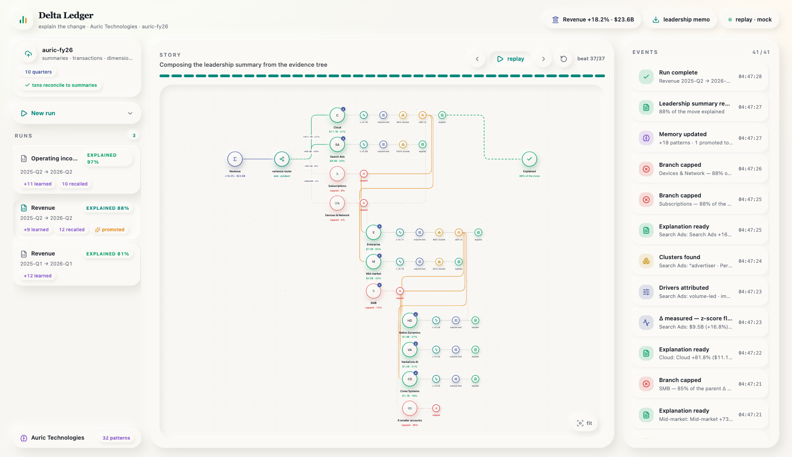
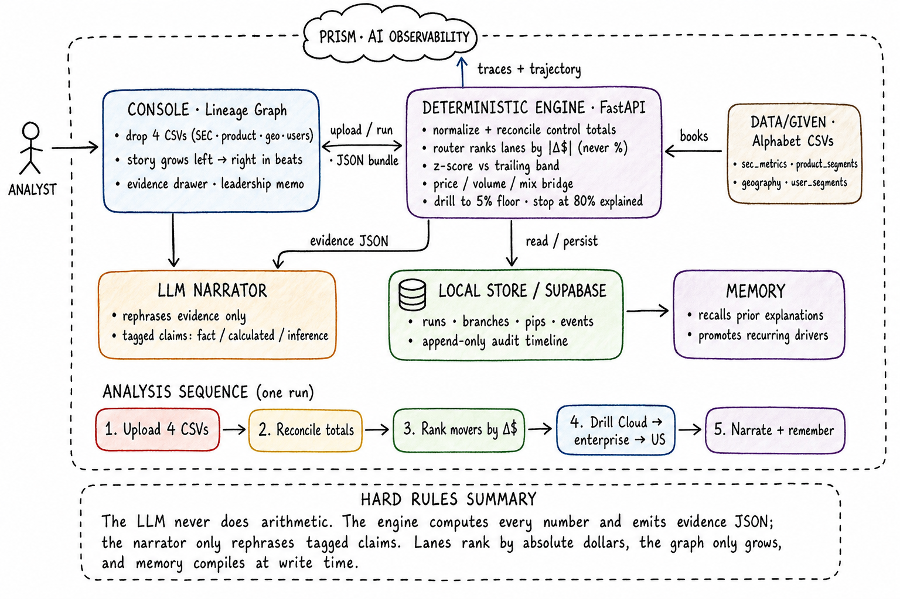

# Delta Ledger — Explain the Change

An FP&A agent that answers *"why did this number move?"* and shows its work as a
**growing lineage graph**. Given multi-period summaries + transaction-level CSVs,
a deterministic engine decomposes the metric, z-scores each branch against its
trailing band, attributes the delta (price / volume / mix / customer), clusters
the transactions behind it, and recurses until ~80% of the variance is explained
or branches fall below materiality. An LLM only narrates the finished evidence —
**it never does arithmetic**. Every run teaches a persistent company memory, so
the next run opens with context like *"Cloud growth has exceeded 20% for 3
consecutive periods."*

Built for the **Maximor — Money Operations — "Explain the Change"** track. UI
patterns forked from the Rock Scheduler ops console (beats, clay pucks/pips,
event stream), re-themed for finance.



## Architecture



One analyst-facing console, one deterministic engine, one narrator that is
never allowed to touch a number. The analyst drops the four CSVs; the engine
reconciles control totals, ranks the movers by absolute dollars, bridges
price/volume/mix, and drills until ~80% of the move is explained; the LLM only
rephrases the finished evidence with tagged claims; memory and PRISM traces
persist every run. Full walkthrough: [docs/architecture.md](docs/architecture.md)
(also the **architecture** pill in the console header, or `#architecture`).

## Quickstart

Two paths, same graph. Architecture board is the **architecture** pill in the
header (also `#architecture`) and [docs/architecture.md](docs/architecture.md).

```bash
make install     # uv sync + npm install + prismtrace-sdk
make run-demo    # mock: baked Auric beats → console :5173
```

Live path (Alphabet `data/given` — drop updated CSVs on the rail anytime):

```bash
make api         # FastAPI :8000, seeds dataset alphabet-given
make live        # console :5173, proxy /api → :8000
```

## Demo flow (stage script)

1. **Mock** (default tab): press play. The baked Auric hero run grows
   left → right — metric → variance router → ranked lanes → Cloud drills to the
   whale accounts → leadership memo. No keys, no network.
2. Flip the header to **live**. The canvas idles and asks for the books.
3. Drag the four CSVs from `data/given/` (`sec_metrics` · `product_segments` ·
   `geography` · `user_segments`) onto the upload card. Upload → control totals
   reconcile ✓ → **the engine runs by itself** and the Alphabet analysis plays:
   Cloud + Search carry the move, Cloud drills enterprise → US / APAC / EU,
   ~84% explained in 40 beats.
4. Updated numbers later? Edit any CSV, drop the four files again — new dataset,
   fresh run, same methodology. `New run` re-runs any metric/period pair
   (Revenue, Operating income, Gross profit, FCF).
5. Click any puck for the evidence drawer (z-band, bridge waterfall, clusters,
   tagged claims); the outcome puck exports the memo. Every narration is traced
   to PRISM as agent `delta-ledger`.

PRISM (Observe → Improve → Prove) needs two values in `.env`:

```
PRISMTRACE_API_KEY=pt-sk-...
PRISMTRACE_PROJECT_ID=<uuid>
```

Then `make prism-warmup` so the project has a trace before tomorrow. No keys =
engine still runs; traces are skipped. LLM key is optional (templated narration).

Press play. The hero run (`Revenue · 2025-Q2 → 2026-Q2`) grows left to right:
metric → variance router → 4 ranked lanes → Cloud drills to Enterprise →
Enterprise drills to the three whale accounts → leadership summary. Click any
node for its evidence drawer; click the outcome puck to export the memo.

## What's real vs mock

- **Real:** everything numeric. The bundles under `console/src/mock/` are actual
  engine output (`backend/scripts/make_mock.py`) over `backend/fixtures/` — a
  fictional company, *Auric Technologies*, whose transactions are calibrated to
  reconcile exactly to its reported summaries. 33 pytest cases cover the bridge
  identity, materiality stops, z-scores, and cross-run memory.
- **Mock transport vs live:** mock replays baked beats. Live posts to FastAPI,
  which reads `data/given` (or an upload) and returns the same bundle shape.
  `data/schema.sql` + the Supabase writer are still there if you want realtime
  later; local JSON under `backend/.fpa_state` is enough for the demo.

## The demo story (all computed, none hard-coded)

- Revenue **+18.2% ($23.6B)**; Cloud carries **47%**, Search Ads **40%**;
  Subscriptions & Devices capped by the materiality floor.
- Cloud **+81.8%**, z ≈ **+4.8σ** vs its trailing band; clustering finds
  **enterprise · AI Infrastructure**; top 3 accounts = **64%** of the
  enterprise move (concentration flag).
- Search Ads: **paid_clicks +13.0% × cpc +3.0% ≈ +16.4%** vs **+16.8%**
  reported — residual shown, not hidden.
- Run 2 recalls run 1's memory (growth streak, normal ranges) and **promotes** a
  repeated concentration anomaly to a recurring driver.
- Run 3 (Operating income) bridges line items, **cites run 2 instead of
  re-drilling Revenue**, drills COGS by product, and the watch-outs catch
  **CapEx +87.8% → FCF −2.8%**.

## Hard rules

1. LLM never computes — the engine emits evidence JSON; the narrator tags every
   claim (`reported_fact` / `calculated_attribution` / `management_commentary` /
   `agent_inference`).
2. Absolute dollars rank branches, never % growth.
3. The graph only grows — lanes are assigned once, in rank order, append-only.
4. Memory: compiled at write time, read as plain rows at run time — no model
   call inside the attribution loop.

## Layout

```
backend/   fpa/engine (normalize · metric_graph · router · timeseries ·
           attribution · clustering · materiality · run) · fpa/agent (narrator,
           provider-agnostic LLM) · fpa/memory · fixtures/ · tests/
console/   Vite + React + TS + Tailwind v4 + React Flow + recharts
           lib/fold.ts (events → model) · lib/frame.ts (model → graph) ·
           src/mock (baked engine bundles)
data/      schema.sql (companies · datasets · runs · branches · pips · events ·
           memory, realtime-enabled) — for the live backend wire-up
```

`make test` runs the engine suite; `make mock` re-bakes the console bundles;
set `LLM_PROVIDER`/`LLM_API_KEY` in `.env` before `make mock` to get LLM-polished
narration instead of the templated fallback (numbers are identical either way).

The original CLI agent still lives under `src/fpa_agent/` (`fpa-agent --period 2026-Q2`).
The console + `backend/` engine above is the hackathon demo path.
