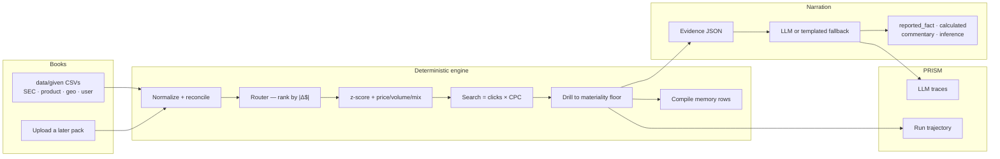

# Architecture

Delta Ledger answers *"why did this number move?"* and shows the walk as a
growing lineage graph. The rule that organizes the system: **the engine does
every number; the LLM only narrates finished evidence.** The console is a
window over an append-only event log. The high-level and detailed views are
two projections of the same live `fold()` → `frame()` state.

Companions: the [README](../README.md) is the one-page demo script.

## One live evidence path



FastAPI loads `data/given` as project `alphabet-given`, or accepts an uploaded
company ledger. Each run follows the same deterministic evidence path.

## The walk, as beats

| Beat | Who | What happens |
| --- | --- | --- |
| 1 | Normalizer | Load summaries + transactions. Scale user-segment rows so Σ revenue equals reported product totals. Fail closed if recon is off. |
| 2 | Router | Score every axis. Children ranked by absolute dollars, never % growth. Lanes assigned once, append-only. |
| 3 | Timeseries | z-score the branch against its trailing growth band. Flag outside ±2σ. |
| 4 | Attribution | Price / volume / mix / customer / geo bridge. Search also checks `paid_clicks × cpc` vs reported revenue and **shows the residual**. |
| 5 | Cluster | Transaction clusters + top-N concentration. |
| 6 | Drill | Product → user segment (`customer_type`, else `sub_product`, else geo) → accounts. Stop at 5% share, 80% explained, depth 4. |
| 7 | Narrator | Rephrase evidence only. Every claim is tagged. |
| 8 | Memory | Compile at write. Next run reads plain rows — no model inside the loop. |
| 9 | PRISM | One `trace_llm` per narration, one `submit_trajectory` per finished run. Observe → Improve → Prove. |

## Package walkthrough

### backend/fpa/engine — the work plane

| File | Role |
| --- | --- |
| `normalize.py` | Load summaries / txns / KPIs. Reconcile control totals (0.5%). |
| `given.py` | Map `data/given` Alphabet CSVs onto that same `Dataset`. User-segment rows are the txn grain. |
| `metric_graph.py` | P&L identities + operational ones (`Search` / `Search Ads` = clicks × CPC). |
| `router.py` | Pick the axis, rank children by \|Δ$\|. Product drills fall through customer_type → sub_product → geography. |
| `timeseries.py` | Trailing band, z-score, growth series for the drawer. |
| `attribution.py` | Bridge + KPI reconciliation. Arithmetic lives here. |
| `clustering.py` | Customer clusters from standardized Δ$ + type/sub_product. |
| `materiality.py` | Stop rules: `min_share=0.05`, `stop_at_explained=0.80`, `max_depth=4`, `top_n=3`. |
| `run.py` | Orchestrator. Emits the event log the console folds. |

### backend/fpa/agent + memory + observe

| File | Role |
| --- | --- |
| `narrator.py` | Branch + run narration, follow-up ask. Tags every claim. |
| `providers.py` | OpenAI / Anthropic / Gemini over httpx. Failure → templated text. |
| `memory/store.py` | Compiled rows. Recall / write / promote recurring drivers. |
| `observe.py` | `prismtrace-sdk` when keys exist; HTTP fallback; no-op otherwise. |

### backend/fpa/api — the live seam

`GET /health` · `GET /catalog` · `POST /datasets` · `POST /runs` ·
`GET /runs/{id}` · `POST /runs/{id}/ask`

Seeded dataset id is `alphabet-given` → `data/given/`. Uploads land under
`backend/.fpa_state/datasets/`. Runs are JSON bundles the console already knows.

### console/ — the window

Same clay language as Rock Scheduler (beats, pucks, pips, event log), finance
tint. `lib/fold.ts` turns events into a model; `lib/frame.ts` lays it out
deterministically so live growth never reflows. Users switch between a compact
leadership lineage and the complete audit lineage. The header also opens the
architecture board (`#architecture`).

## Hard rules

1. LLM never computes.
2. Absolute dollars rank branches.
3. The graph only grows.
4. Memory is compiled at write, read as rows at run time.

## PRISM keys (needed to seed traces before the hackathon)

```
PRISMTRACE_API_KEY=pt-sk-...
PRISMTRACE_PROJECT_ID=<uuid>
PRISMTRACE_HOST=https://prism.blockconvey.com
```

```bash
make prism-warmup   # one live given-data run + traces, or a clear "need keys" message
```

Without keys the product still runs. Tavily is not on the critical path —
**Search** in the graph is Alphabet Search (clicks × CPC), not a web-search tool.
